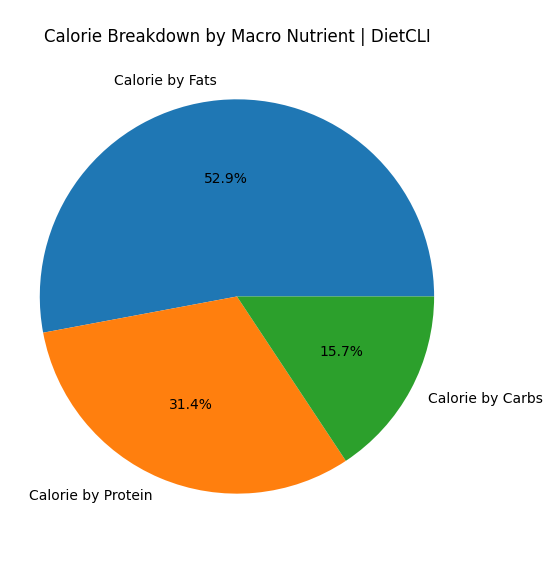

DietCli is a blazingly fast, cross-platform, command line nutrition tracker written in C++.

Note: Previously it was known as "NutritionCLI". However, that version used INI, was slow and buggy and hence is no longer supported. Though it's [source code](https://github.com/hstsethi/nutritioncli) is available for historical purposes.

"Blazingly fast", is not just in name. See the benchmark at [Kaggle](https://www.kaggle.com/code/hstsethi/dietcli-benchmark) or run it yourself. Below are the results of the whole use, including printing and calculations, **not just parsing**.:

```
real    0m0.003s
user    0m0.001s
sys     0m0.002s
```

## Usage

Download the release or [build](build.md) it yourself.

To avoid clutter and promote a more structured, familiar approach of documentation. The documentation has been moved to man page. You can download the source and view it by `man ./dietcli.1` or read the [markdown version](docs/dietcli.md).


To generate a pie chart of calorie breakdown by macro nutrient, simply run `python visualize.py`. 


## Examples



```

$ ./dietcli macro my-custom-config.json
Protein RDI amount : 50 Consumed amount : 20     Remaining : 30
Carbs   RDI amount : 225        Consumed amount : 100     Remaining : 125
Fats    RDI amount : 70 Consumed amount : 10     Remaining : 60
Fiber   RDI amount : 30 Consumed amount : 20     Remaining : 10

```

```
$ ./dietcli vit | awk '{print $1, $12}'

# NutrientName, RemainingAmount

A 200
B12 1
C 81
D 18
E 7
K 3

```

# Acknowledgements

- USDA for providing RDI of nutrients.

- Tencent for RapidJSON library.

